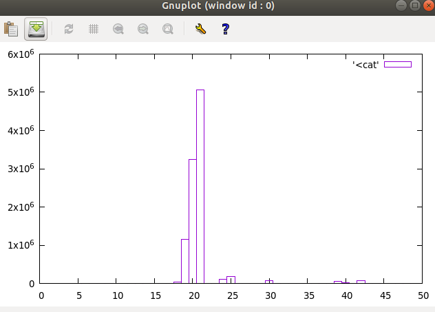
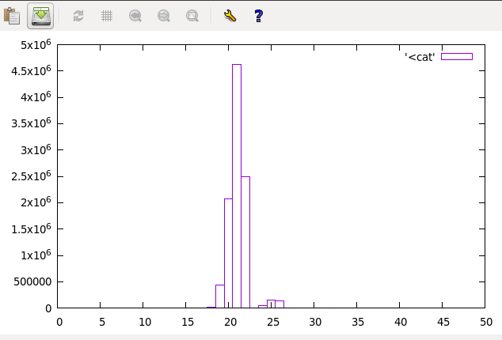
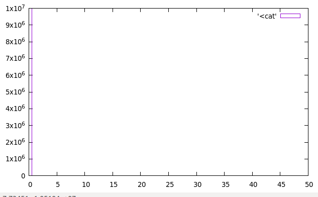

TASK B
====

## Average read time
rdt: 8.550103 ns  
gettime: 21.565937 ns  
times: 459.000000 ns  

## Shortest time difference
__rdtsc():   
  
clock_gettime():  
  
times():  

## Conclusion

rdtsc is the fastest method - it reads the CPU Time Stamp counter directly and conversion from clock ticks to nanoseconds is done after fetching.  
The clock_gettime method is a bit slower - this initializes a timespec with wall time value.  
The slowest method is the times method - has to switch back and forth to and from kernel between every call.